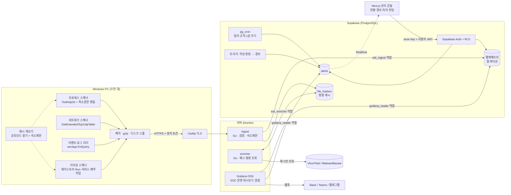

# Endpoint EDR (Passive) — 시스템 아키텍처

> 커널 드라이버 없이 Windows 사용자 모드 API만 **읽기 전용**으로 사용하는 수동형 모니터링 에이전트와,
> 중앙 수집·탐지·시각화 백엔드의 설계 문서.
> Sysinternals Process Explorer / TCPView / Autoruns + 이벤트 로그 감시를 하나의 서비스로 묶고 원격에서 본다고 생각하면 된다.

---

## 1. 전체 흐름



| 단계 | 구성요소 | 핵심 책임 |
|---|---|---|
| 수집 | `agent/` (Go, Windows 서비스) | 읽기 전용 수집, 차분 전송, 오프라인 스풀 |
| 수신 | `services/ingest` | 장치 인증, 입력 검증, 대량 적재, 중복 제거 |
| 저장 | Supabase Postgres | 조직 단위 스키마, 월 파티션, RLS |
| 판단 | pg_cron 탐지 함수 + 트리거 | 규칙 기반 경보 생성 (에이전트는 판단하지 않음) |
| 보강 | `services/enricher` | 해시 평판 조회(속도 제한·캐시·재조회 주기) |
| 시각화 | Grafana / Next.js 콘솔 | 실시간 모니터링·알림 / 등록·경보 처리 등 관리 작업 |

**설계 원칙: 에이전트는 "눈"만, 판단은 서버가.** 탐지 로직을 서버에 두면 규칙을 바꿀 때 수천 대 PC를 업데이트할 필요가 없고, 에이전트는 작고 예측 가능하게 유지된다.

---

## 2. 충돌 제로(Zero-Interference) 설계

기존 보안 에이전트(DRM·DLP·백신·EDR)가 깔린 PC에서 충돌이 나는 원인은 대부분 **커널 필터 경합, 프로세스 메모리 접근, 파일 잠금, 후킹, 자원 경쟁**이다. 아래 원칙으로 각각을 차단한다.

| 위험 | 이 에이전트의 선택 | 코드 위치 |
|---|---|---|
| 커널 드라이버·미니필터 경합 | 드라이버 없음. 사용자 모드 Win32 API만 | 전체 |
| 타 제품 자기보호(Self-Protection) 트리거 | `PROCESS_QUERY_LIMITED_INFORMATION` 만 요청. `PROCESS_VM_READ` 없이 `NtQueryInformationProcess(ProcessCommandLineInformation)` 로 명령줄 획득 | `collector/process_windows.go` |
| DLL 주입·API 후킹 | 사용하지 않음 (CI 가드레일로 금지) | `scripts/check-passive.sh` |
| 파일 잠금으로 인한 업데이트/검사 실패 | `FILE_SHARE_READ\|WRITE\|DELETE` 로 열기, 해시 캐시, 초당 읽기량 제한 | `hasher/hasher_windows.go` |
| 이벤트 로그 서비스 부하 | 실시간 구독 대신 RecordID 기반 증분 폴링, 1회 최대 2,000건 | `collector/eventlog_windows.go` |
| 감사 정책 변경 충돌 | 에이전트는 `auditpol` 을 건드리지 않음. GPO로 설정 | §6 |
| 네트워크 스택 개입 | 패킷 캡처·WFP 필터 없음. 연결 테이블 조회만 | `collector/network_windows.go` |
| CPU·디스크 경쟁 | `PROCESS_MODE_BACKGROUND_BEGIN`(CPU·I/O·메모리 우선순위 낮춤), Job Object 메모리 상한, `GOMAXPROCS=2`, 수집기별 주기 분산 + 시작 지터 | `sysutil/`, `main.go` |
| 부팅 시 자원 경합 | 서비스 "지연된 자동 시작" | `main.go install()` |
| 시스템 개입 | 프로세스 종료·파일 삭제·레지스트리 쓰기·방화벽 변경 **코드 자체가 없음** | 가드레일 스크립트로 강제 |

에이전트가 디스크에 쓰는 곳은 `C:\ProgramData\EndpointEDR\` 하나뿐이다(설정, DPAPI로 암호화된 장치 토큰, 상태 파일, 전송 실패 시 스풀 — 상한 50MB).

> ⚠ "충돌 제로"는 설계 목표이지 보증이 아니다. 전사 배포 전 **사내 표준 PC 이미지(Escort 등 기존 보안 솔루션 포함)에서 72시간 이상 파일럿**을 돌리고, 기존 보안 솔루션 담당자(또는 벤더)에 실행 파일 예외(화이트리스트) 등록을 요청한다. 서명되지 않은 실행 파일은 백신이 차단할 수 있으므로 **코드 서명**(사내 인증서 가능)을 해 둔다.

### 수동형 설계의 한계 (보안 담당자가 알아둘 것)
- 폴링 방식이라 **수 초 안에 실행되고 끝나는 프로세스·연결은 놓칠 수 있다.** 보완: Sysmon(마이크로소프트 무료 도구, 단 자체 드라이버 사용)을 필요한 PC(서버 등)에만 설치하면 에이전트가 `Microsoft-Windows-Sysmon/Operational` 채널을 읽도록 쿼리만 추가하면 된다.
- 차단·격리 기능은 없다(의도된 설계). 탐지·가시성 도구로 쓰고, 대응(격리·치료)은 기존 보안 솔루션과 IT팀 절차로 한다.
- 관리자 권한을 가진 공격자는 서비스를 멈출 수 있다 → 서버가 "에이전트 무응답" 경보를 낸다(Grafana 규칙 포함).

---

## 3. 수집 모듈 상세

| 모듈 | Sysinternals 대응 | API | 주기(기본) | 전송 방식 |
|---|---|---|---|---|
| 프로세스 | Process Explorer | `CreateToolhelp32Snapshot`, `QueryFullProcessImageName`, `GetProcessTimes`, `OpenProcessToken(TOKEN_QUERY)`, `NtQueryInformationProcess` | 60초 | 새 프로세스 + 종료된 프로세스, 1시간마다 전체 |
| 해시 | (VirusTotal 연동) | `CreateFile`(공유 모드) + SHA-256 | 프로세스/자동실행 발견 시 | 해시만 전송 |
| 네트워크 | TCPView | `GetExtendedTcpTable`, `GetExtendedUdpTable` (`OWNER_PID`) | 15초 | 새 연결만 + 1시간마다 전체 |
| 이벤트 로그 | 이벤트 뷰어 | `EvtQuery`(구조화 XML 쿼리), `EvtNext`, `EvtRender` | 10초 | 증분(마지막 RecordID 이후) |
| 지속성 | Autoruns | 레지스트리(읽기 권한만), `System32\Tasks` XML 파싱 | 10분 | 기준선 대비 추가/변경/삭제 |
| 자산 정보 | 시스템 정보·프로그램 제거 목록 | 레지스트리(`CurrentVersion`, `Uninstall` 키), `GetSystemFirmwareTable`(SMBIOS 일련번호), `GlobalMemoryStatusEx`, `GetDiskFreeSpaceEx`, `NetGetJoinInformation`, `GetAdaptersAddresses` | 6시간 | 바뀌었을 때 또는 24시간마다 전체 |
| 보안 상태 | (Windows 보안 설정 화면) | 레지스트리 값 읽기, 서비스 상태 조회(`SC_MANAGER_CONNECT` + `SERVICE_QUERY_STATUS`) | 1시간 | 바뀌었을 때 또는 6시간마다 전체 |
| 문서 감사 | (보안 관리자 PC 감사) | `CreateFile`(공유 모드·`GENERIC_READ`) + 형식별 글자 추출(아래), 정책은 `GET /v1/policy` | 정책 확인 15분, 검사는 관리자 정책 간격(기본 매주) 또는 콘솔 "지금 검사" | 파일 위치·크기·저장 시각 + 종류별 **건수만**(배치 200개, 마지막 배치 `final`) |

지속성 수집 범위: `HKLM/HKU …\Run, RunOnce`(32/64비트), 정책 Run, Winlogon `Shell/Userinit`, IFEO `Debugger`, 자동 시작 서비스 `ImagePath`, 시작프로그램 폴더, 예약 작업.

자산 정보: OS 이름·에디션·버전·빌드(UBR 포함)·설치일, 제조사·모델·**일련번호**·BIOS, CPU·메모리·시스템 디스크, 도메인 가입 여부, 마지막 로그온 사용자, 네트워크 어댑터(MAC·IP), 설치 프로그램(PC 전체 + 로그온한 사용자별, Windows 가 숨기는 구성 요소·KB 업데이트 제외, 최대 5000개).
보안 상태 점검(모두 **읽기만**, 꺼져 있어도 켜지 않음): 실시간 악성코드 검사(Defender 또는 알려진 백신 서비스, `av_services` 로 사내 백신 추가), 방화벽 3개 프로필, UAC, 자동 업데이트, SMBv1, 원격 데스크톱 NLA, WDigest 평문 자격 증명, 자동 로그온 비밀번호(값 이름만 확인), 화면 잠금 15분, LSA 보호, PowerShell 스크립트 기록. Windows 지원 종료 여부는 서버가 자산 정보와 수명 주기 표(`os_lifecycle`)로 판단한다.

문서 감사(관리자가 켜야만 동작, 기본 꺼짐 — 아래 §7-3):
- 대상: 정책의 사용자 폴더(바탕 화면·문서·다운로드, OneDrive 로 옮겨진 같은 폴더 포함) + 추가 절대 경로. `AppData`·프로그램·숨김 폴더, 연결 지점(재분석 지점), **내려받지 않은 클라우드 파일**은 열지 않는다.
- 형식: txt·csv(UTF-8/UTF-16), docx·xlsx·pptx·hwpx(zip 안 XML), hwp(HWP 5.0 복합 문서 → 본문 레코드), pdf(`github.com/ledongthuc/pdf`, 300쪽까지), doc·xls·ppt(문자열 추출). 암호 문서·배포용 HWP 는 "암호가 걸린 문서"로 건너뛴다. 파일당 글자 8MiB, 크기 상한(기본 20MB) 초과는 읽지 않음, zip 폭탄 상한, 모든 추출은 panic 복구.
- 검출: 주민등록번호(날짜 확인, 구분자 없는 13자리는 검증 숫자도), 외국인등록번호, 여권번호, 운전면허번호(지역 번호), 카드번호(Luhn), 휴대전화번호(기본 꺼짐), 관리자 키워드(최대 50개, 대소문자 무시), 마지막 저장이 기준보다 오래된 문서.
- 부담: 읽기 속도 상한(기본 초당 8MB, `docscan_mb_per_sec`), 파일마다 잠깐 쉬기, 한 번에 10만 파일·오래된 문서 5000개 상한. 별도 고루틴에서 돌고 수집 주기에 영향을 주지 않는다.
- 서버로 가는 것: 경로·크기·저장 시각·종류별 건수·키워드 횟수. **문서 내용과 개인정보 값은 보내지 않는다.** 중간에 멈춘 검사는 마지막 배치를 보내지 않아 기존 결과를 지우지 않는다.
- 실기 확인: `edr-agent.exe docscan C:\Users\me\Documents 대외비` (결과를 화면에만 출력, 전송하지 않음).

수집 이벤트:

| 채널 | Event ID | 의미 |
|---|---|---|
| Security | 4625 | 로그온 실패 (무차별 대입) |
| Security | 4624 (LogonType 3, 10만) | 네트워크/RDP 로그온 성공 |
| Security | 4648 | 명시적 자격 증명 로그온 (횡적 이동 단서) |
| Security | 4720 / 4728 / 4732 / 4756 | 계정 생성 / 보안 그룹 구성원 추가 |
| Security | 4698 / 4702 | 예약 작업 생성 / 변경 |
| Security | 1102 | 보안 감사 로그 삭제 |
| System | 7045 | 서비스 설치 |
| System | 104 | 시스템 로그 삭제 |

---

## 4. 서버 측 탐지 규칙

`supabase/migrations/20261002000003_detection.sql` 에 구현(EDR-AUTH-001 은 `0006`, IOC·SW·POS 규칙은 `0008` 에서 추가). pg_cron 이 1분마다 `edr_run_detections()` 를 실행하며(pg_cron 이 없으면 enricher 가 `RUN_DETECTIONS=1` 로 대신 실행), 워터마크로 "마지막 실행 이후 적재된 데이터"만 본다. 같은 경보는 `dedup_key` 유니크 제약으로 한 번만 생긴다.

| 규칙 ID | 조건 | 심각도 |
|---|---|---|
| EDR-AUTH-001 | 같은 PC·같은 출발지에서 **발생 시각 기준** 10분 안에 4625가 10회 이상. 네트워크가 끊겼다가 늦게 도착한 이벤트도 탐지(경보에 `delayed` 표시) | high |
| EDR-AUTH-002 | 출발지 IP의 실패 5회 이상 직후 같은 IP에서 4624 성공 | critical |
| EDR-AUTH-003 | 공인 IP 에서 RDP(LogonType 10) 로그온 성공 | high |
| EDR-LOG-001 | 1102 / 104 로그 삭제 | high |
| EDR-PERSIST-001 | 7045 서비스 설치 | medium |
| EDR-PERSIST-002 | 자동 실행 항목 추가·변경 (AppData·Temp·Public 경로면 high) | medium/high |
| EDR-PERSIST-003 | 4698/4702 예약 작업 생성·변경 | medium/low |
| EDR-ACCT-001/002 | 계정 생성 / 보안 그룹 구성원 추가 | medium/high |
| EDR-NET-001 | 공인 IP 에서 3389 인바운드 연결 수립 | high |
| EDR-MAL-001 | 해시 평판이 악성/의심으로 판정된 파일을 최근 7일 내 실행 (트리거) | critical/medium |
| EDR-IOC-001 | 등록한 위협 지표(SHA-256)와 같은 파일이 실행되거나 자동 실행에 등록됨. 지표 등록 시 최근 7일 소급(트리거) | 지표의 심각도 |
| EDR-IOC-002 | 등록한 위협 지표 IP·대역과 통신하거나 그 주소에서 로그온 시도. 지표 등록 시 최근 7일 소급 | 지표의 심각도 |
| EDR-SW-001 | 금지 소프트웨어 정책에 맞는 프로그램이 설치됨(새 설치, 또는 정책 생성·변경 시 이미 설치된 PC). 장치·정책마다 1건, 한 번 실행에 최대 500건 | 정책의 심각도 |
| EDR-POS-001 | 실시간 악성코드 검사·방화벽이 꺼지거나 WDigest 평문 저장이 켜짐 — **통과 → 실패로 바뀐 순간**만(처음부터 실패는 보안 상태 화면에서 관리) | high (방화벽 medium) |

규칙 확장 방향: [Sigma](https://github.com/SigmaHQ/sigma) 규칙(Windows 이벤트 로그용 공개 탐지 규칙 모음)을 SQL로 변환해 `detection_rules` 테이블로 데이터화하면, 규칙을 코드 배포 없이 PC 그룹·부서별로 켜고 끌 수 있다.

### 4-1. 알림 연동 (슬랙·이메일·SIEM)

`supabase/migrations/20261002000011_notifications.sql`. 경보가 생기면(= 탐지 함수가 `alerts` 에 INSERT) 트리거 `edr_enqueue_notifications` 가 조건에 맞는 채널마다 발송 대기 행(`notification_outbox`)을 1건 만든다. 조건은 **심각도 하한**(`min_severity` 이상)과 **규칙 접두사**(`rule_prefixes`, 비우면 전체)다. 적재 시 해당 규칙의 MITRE 전술·기법도 payload 에 함께 담는다.

보내는 쪽은 enricher 의 알림 루프(`RUN_NOTIFIER=1`, 기본 켜짐)다. 대기 행을 임대(`edr_lease_notifications`, `FOR UPDATE SKIP LOCKED`)해 가져가 종류별로 보내고(`services/internal/notify`), 결과를 `edr_mark_notification` 으로 표시한다(실패는 5회까지 간격을 두고 재시도). 전송은 이벤트 구동이라 pg_cron 일정을 두지 않고, 오래된 보낸 기록 정리(`edr_prune_notifications`, 30일)만 같은 루프에서 6시간마다 한다.

| 종류 | 대상(`target`) | 비밀값 |
|---|---|---|
| 슬랙 | 표시용 채널 이름 | `secret_ref` 가 가리키는 `.env` 키에 Incoming Webhook URL |
| 이메일 | 받는 주소(쉼표로 여러 명) | SMTP 공통 설정(`.env` 의 `SMTP_*`) |
| SIEM(syslog) | `host:port`(TCP 는 `/tcp`) | 없음. RFC 5424 형식에 JSON 메시지 |
| 웹훅 | URL(또는 `secret_ref`) | 선택 |

**비밀값(웹훅 URL·SMTP 비밀번호)은 DB·브라우저에 저장하지 않는다.** 채널에는 비밀값이 든 `.env` 키 **이름**(`secret_ref`)만 두고, 실제 값은 서버 `.env` 에서 읽는다. 채널 관리(추가·수정·삭제)는 콘솔 **설정 → 알림 연동**에서 소유자·관리자만 할 수 있고(RLS), 변경은 감사 기록(`notification.channel.*`)에 남는다. "테스트 알림 보내기"(`console_notification_test`)는 대기 행 1건을 만들어 실제 경로로 도착하는지 확인한다.

### 4-2. 외부 EDR(Wazuh) 경보 수집

`supabase/migrations/20261002000012_wazuh_alerts.sql`, 설정은 `deploy/wazuh/`. 실행 전 차단·대응은 이 프로젝트 범위 밖이므로, 그 역할은 검증된 오픈소스(Windows Defender + **Wazuh**)에 맡기고 **Wazuh 의 경보만 이 콘솔 한 화면에서 함께 본다**. 단방향 수집이며 Wazuh·PC 를 제어하지 않는다.

Wazuh integrator 가 경보를 수집 서버의 웹훅 `POST /v1/wazuh` 로 보낸다(공유 비밀 `WAZUH_WEBHOOK_SECRET` 으로 인증, 조직은 `WAZUH_TENANT_ID`). 저장 함수 `edr_ingest_wazuh_alert` 가 `alerts` 에 `source='wazuh'` 로 넣고, rule level 을 심각도로(12↑ critical, 9↑ high, 7↑ medium, 그 미만 low), 에이전트 이름을 장치로 맞춘다(못 맞추면 장치 없이 저장). Wazuh 경보 id 로 중복을 막는다. 저장된 경보는 기존 경보 화면·인시던트 묶음·알림 연동(0011)을 그대로 타며, 콘솔 경보 화면의 **출처 필터(내장 탐지·Wazuh)** 와 `Wazuh` 배지로 구분한다. `alerts.source` 컬럼은 기존 경보를 `edr` 로 둔다.

---

## 5. 데이터·보안 설계

### 5-1. 왜 에이전트가 Supabase에 직접 쓰지 않는가
- Supabase `service_role` 키나 DB 비밀번호를 PC에 배포하면, 한 대만 털려도 **전사 보안 로그 DB가 노출**된다.
- 그래서 에이전트는 **장치별 토큰**만 가진다. 토큰은 등록 시 1회 발급, 서버는 SHA-256 해시만 저장, PC에는 DPAPI(머신 범위)로 암호화해 보관한다. 장치를 비활성화하면 5분 안에 토큰이 거부된다.
- ingest 는 `edr_ingest` 라는 INSERT 전용 DB 역할로 접속한다. ingest 서버가 뚫려도 기존 데이터를 읽거나 지울 수 없다.

### 5-2. 테이블 개요
- `tenants`, `tenant_members(role: owner/admin/analyst/viewer)` — 조직 단위. 회사 하나면 tenant 1개만 만들어 쓰고, 계열사·법인을 나눠 볼 필요가 생기면 tenant 를 추가하면 된다
- `enrollment_keys`(해시만 저장), `devices`(토큰 해시)
- 텔레메트리(월 파티션): `process_events`, `net_connections`, `security_events`
- `autoruns`(현재 상태) + `autorun_changes`(이력)
- `file_hashes`(전역 평판 캐시) + `tenant_file_hashes`(테넌트가 본 해시)
- `alerts`(경보, Realtime 발행, 판정 `resolution`) + `alert_comments`(처리 기록) + `alert_suppressions`(예외)
- `processes_current`(장치별 지금 실행 중인 프로세스 — 시작/종료 반영, 1시간마다 전체 교체)
- `detection_rules`(규칙 카탈로그·MITRE ATT&CK 매핑·켜기/끄기), `devices.health`(에이전트 자원 사용량)
- 자산(0008): `device_inventory`(장치당 1행), `device_software`(현재 설치 목록), `software_changes`(설치·삭제·업데이트 이력, 1년 보관), `os_lifecycle`(Windows 지원 종료일 참조표)
- 보안 상태(0008): `posture_checks`(점검 항목·가중치 참조표), `device_posture`(장치×항목 현재 결과·실패 시작 시각), `posture_policies`(조직별 점수 반영 여부). 점수 = 반영 항목 가중치 중 통과(주의 포함) 비율
- 정책·지표(0008): `software_policies`(취약 버전·금지 소프트웨어, 기본 제공 목록은 조직마다 복사), `iocs`(SHA-256·IP·대역, 너무 넓은 대역 거부)

### 5-3. RLS 요약
| 역할 | 읽기 | 쓰기 |
|---|---|---|
| anon | 없음 | 없음 |
| authenticated (콘솔 사용자) | 자기 테넌트 행만 | 경보의 `status/assigned_to` 만(analyst 이상), 장치 `tags/status` 만(admin 이상), 위협 지표(analyst 이상), 소프트웨어 정책·점검 항목 반영(admin 이상) |
| edr_ingest | 장치·등록키 조회 | 텔레메트리 INSERT, autoruns upsert, 자산·보안 상태는 저장 함수(`edr_apply_inventory`·`edr_apply_posture`, 장치의 조직 재확인)만 |
| edr_enricher | 해시·프로세스 | `file_hashes` 갱신, 경보 생성 |
| grafana_reader | 전체(사내 SOC용) | 없음 |

- 텔레메트리는 콘솔 사용자에게 INSERT/UPDATE/DELETE 권한 자체가 없다 → 증거 위·변조 불가.
- `file_hashes` 는 자기 테넌트가 본 해시만 보인다 → 조직(계열사)을 나눴을 때 서로의 사용 프로그램이 보이지 않는다.
- 파티션 테이블을 이름으로 직접 조회해도 RLS 로 0건.
- 검증: `supabase/tests/rls_and_detection_test.sql` (로컬 PostgreSQL 16 에서 통과 확인).

### 5-4. 용량·보존
- PC 1대당 하루 대략: 프로세스 수백 행, 연결 수백~수천 행, 보안 이벤트 수십~수백 행(서버급은 더 많음). 차분 전송으로 크게 줄어든다.
- 보존 기본 3개월, 파티션 단위 `DROP` (DELETE 대비 부하가 거의 없음).
- 파티션 미리 만들기(2개월 앞)와 보존 정리는 `edr_maintenance()` 하나로 실행한다. pg_cron 이 있으면 매일, 없으면 enricher(`RUN_DETECTIONS=1`)가 시작 시·6시간마다 실행한다. **이 작업이 멈추면 준비된 파티션이 끝나는 달부터 수집 저장이 실패**하므로, 마지막 실행 시각과 파티션 남은 기간을 콘솔 설정 화면 "시스템 상태"에서 보여 준다.
- 수천 대 이상으로 커지면 텔레메트리만 ClickHouse(Apache 2.0)로 분리하고 Postgres 에는 장치·경보·해시만 남기는 구조로 확장한다. ingest 의 저장부만 바꾸면 된다.

---

## 6. 사내 PC 사전 설정 (GPO)

에이전트는 시스템 설정을 바꾸지 않으므로, 다음 감사 정책은 IT 팀이 GPO로 켜야 한다.

| 감사 정책 | 필요한 이벤트 |
|---|---|
| 로그온/로그오프 → 로그온 (성공·실패) | 4624, 4625 |
| 로그온/로그오프 → 기타 로그온 이벤트 | 4648 |
| 계정 관리 → 사용자 계정 관리, 보안 그룹 관리 | 4720, 4728, 4732, 4756 |
| 개체 액세스 → 기타 개체 액세스 이벤트 | 4698, 4702 |

보안 로그 최대 크기는 최소 256MB 이상을 권장한다(에이전트가 꺼져 있는 동안 로그가 덮어써지지 않도록).

---

## 7. 사내 운영 권장 구조

이 시스템은 **회사 내부 전용**이다. 외부에 판매·배포하지 않으므로 라이선스·과금·멀티 고객 같은 고민은 빼고,
대신 사내 보안 정책·개인정보·운영 절차를 기준으로 정리한다.

### 7-1. 화면 역할 분담 — Next.js 콘솔이 주 화면, Grafana 는 보조
| 화면 | 쓰는 사람 | 용도 |
|---|---|---|
| Next.js 관리 콘솔 (`apps/web`) | 보안 담당자·IT 관리자 | 현황판, 경보 처리(확인·종결·판정·메모·예외), 장치별 프로세스 트리·타임라인, 전 PC 헌팅, 규칙 켜기/끄기, 등록키 — 매일 쓰는 화면 (§9) |
| Grafana | 보안 담당자 | 장기 추이, 임의 SQL 분석, 외부 알림(메신저·메일 웹훅) |

- 사내에서 **수정 없이** 쓰는 Grafana OSS 는 AGPLv3 의무가 문제 되지 않는다. 다만 경보 처리·예외 같은 "쓰기" 작업과 권한별 화면은 콘솔이 맡는다.

### 7-2. DB 위치 — 사내 보안 정책 먼저 확인
수집 데이터에는 **직원 로그온 계정명, 실행 프로그램 명령줄, 접속 IP** 가 들어간다. 이 로그를 외부 클라우드에 둘 수 있는지 정보보호 담당 부서에 먼저 확인한다.

| 선택지 | 장점 | 언제 |
|---|---|---|
| A. Supabase Cloud | 설치·백업·업데이트 부담 없음, 가장 빠름 | 보안 로그의 외부 보관이 허용될 때 |
| B. 사내 서버에 Supabase 셀프호스팅 (Docker, Apache 2.0) | 로그가 회사 밖으로 나가지 않음 | 반출 불가·망분리 환경 (국내 기업은 이쪽이 많다) |

마이그레이션은 두 경우 모두 그대로 쓸 수 있다(Supabase 전용 기능 의존이 `auth.uid()`, pg_cron 정도로 작다).
B안이면 Caddy 인증서도 사내 인증서로 바꾼다(`deploy/Caddyfile` 주석 참고).

### 7-3. 직원 PC 모니터링에 따른 개인정보·고지
- 정보보호 규정·보안 서약서 등에 **업무용 PC 보안 모니터링 사실과 수집 항목**을 고지한다(구체적 요건은 인사·법무 부서 확인).
- 수집 범위는 보안 목적에 필요한 것만: 화면·키보드 입력·파일 내용은 수집하지 않는다(이 에이전트는 애초에 그런 기능이 없다).
- 조회 권한 최소화: 대시보드 계정은 보안 담당자에게만, 역할(viewer/analyst/admin)로 구분. 보존 기간 기본 3개월(`edr_drop_old_partitions`).
- **문서 감사**(마이그레이션 0009)는 PC 안 문서를 읽는 기능이라 따로 통제한다.
  - 기본 꺼짐. 켜려면 콘솔에서 "직원 고지 완료"를 확인해야 한다(DB 제약 `not enabled or notice_confirmed_at is not null`). 공지 예시: `docs/DOC_AUDIT_NOTICE.md`.
  - 정책·결과·요청은 **소유자·관리자만**(RLS + `console_doc_*` 함수의 `edr_require_admin`). 분석가·열람자는 화면도 CSV 도 볼 수 없다.
  - 감사 기록: 켬·끔·정책 변경·검사 요청(트리거), 결과 조회(같은 사람 10분에 한 줄)·내려받기(함수 안에서 기록).
  - 결과는 PC 마다 "지금 있는 문서"만 남는다(다음 검사에서 다시 보이지 않으면 삭제). 검사 기록·요청은 1년 보관(`edr_maintenance`).

### 7-4. 해시 평판 조회 (VirusTotal)
- VirusTotal Public API 는 **분당 4회·하루 500회** 제한이 있고, 약관상 업무용 사용에 제한 조항이 있으므로 사내 사용 전에 약관을 확인한다.
  필요하면 유료(Premium) 계약을 검토한다.
- PC 수백 대면 처음 수집되는 고유 해시가 수천 개라 무료 한도로는 며칠에 걸쳐 조회된다. 같은 해시는 한 번만 조회하도록 캐시가 이미 들어 있고(`file_hashes`), 재조회 주기도 판정별로 길게 잡혀 있다.
- MalwareBazaar(abuse.ch) 해시 조회를 함께 쓰면 공개된 악성 샘플은 한도 걱정 없이 잡는다.
- **파일 자체는 절대 업로드하지 않고 해시만 조회**한다(사내 문서·프로그램 유출 방지).

### 7-5. 사용 구성요소 (모두 무료·오픈소스)
| 구성요소 | 라이선스 | 사내 사용 시 |
|---|---|---|
| Go, golang.org/x/sys, pgx | BSD-3 / MIT | 제약 없음 |
| PostgreSQL, Supabase(셀프호스팅) | PostgreSQL / Apache 2.0 | 제약 없음 |
| Next.js, React, Tailwind, shadcn/ui | MIT | 제약 없음 |
| Caddy | Apache 2.0 | 제약 없음 |
| Grafana OSS | AGPLv3 | 수정 없이 사내에서 쓰면 문제 없음 |
| ClickHouse (대수가 많아질 때) | Apache 2.0 | 제약 없음 |

### 7-6. 사내 도입 순서
1. **파일럿**: IT팀 PC 10대 내외, 72시간 이상. 기존 보안 솔루션(Escort 등)과 충돌·오탐·CPU 사용량 확인
2. **예외 등록·서명**: 기존 보안 솔루션 담당자(또는 벤더)에 `edr-agent.exe` 예외 등록 요청, 사내 코드 서명 인증서(AD CS 등)로 서명
3. **감사 정책 GPO 적용**(§6) + 개인정보 고지(§7-3)
4. **배포**: GPO 시작 스크립트 / SCCM / Intune 중 사내에서 쓰는 방식으로 부서 단위 확대
5. **운영 체계**: 경보 담당자 지정, Grafana 알림을 사내 메신저로, 주 1회 경보·오탐 검토 후 규칙 조정
6. **관리 콘솔 운영**: 콘솔 배포(§9), 담당자별 계정·역할 부여, 오탐은 예외로 정리
7. **고도화(선택)**: Sigma 규칙 변환, 예외(화이트리스트) 관리, 에이전트 자동 업데이트

---

## 8. 디렉토리 구조

```
endpoint-edr/
├─ agent/                         # Windows 에이전트 (Go, CGO 불필요)
│  ├─ cmd/edr-agent/main.go       # 서비스 진입점, install/uninstall/console
│  ├─ internal/
│  │  ├─ collector/               # process / network / eventlog / autoruns / inventory(자산) / posture(보안 상태)
│  │  ├─ hasher/                  # 공유모드 SHA-256 + 캐시 + 속도제한
│  │  ├─ sysutil/                 # 백그라운드 모드, Job Object 메모리 상한
│  │  ├─ transport/               # 등록, DPAPI 토큰, gzip 전송, 디스크 스풀
│  │  ├─ config/
│  │  └─ model/                   # 전송 데이터 계약
│  ├─ packaging/config.example.json
│  └─ build.mk                  # make -f build.mk build
├─ services/                      # 서버 (Go)
│  ├─ cmd/ingest/                 # 수집 게이트웨이
│  ├─ cmd/enricher/               # 해시 평판 워커 (+탐지 주기 실행 대체)
│  ├─ internal/{contract,intel}/
│  └─ Dockerfile
├─ supabase/
│  ├─ migrations/                 # core / rls / detection / console / incidents / ops_audit / sso / assets_posture_ioc
│  └─ tests/                      # RLS·탐지·감사 검증 SQL
├─ apps/web/                      # Next.js 관리 콘솔 (§9)
│  ├─ src/app/(console)/          # 현황, incidents, incidents/[id], alerts, hunt, attack, entities, devices, assets, posture, iocs, rules, settings
│  ├─ src/app/api/export/         # CSV 내려받기(자산·소프트웨어·설치 이력·보안 상태·위협 지표)
│  ├─ src/components/             # 공격 그래프, 킬체인 막대, 쿼리 편집기, 경보 작업대, 프로세스 트리, 차트, 명령 팔레트
│  ├─ src/lib/data/               # DataSource 계약 + supabase-source(실데이터) + demo-source(예시 데이터)
│  ├─ src/lib/actions.ts          # Server Action (zod 검증 + 역할 확인)
│  └─ Dockerfile                  # standalone 이미지
├─ contracts/ingest.schema.json   # 에이전트↔서버 데이터 계약 (단일 진실 공급원)
├─ tests/integration/             # 종단 통합 테스트 (콘솔·수집·탐지·권한·감사·SSO·부하, run.sh)
├─ deploy/sso-lab/                # 개인 PC 회사 계정(SSO) 실험실: 테스트용 AD(Samba) + Keycloak — 켜기·끄기 lab.mjs (docs/SSO_LAB.md)
├─ .github/workflows/ci.yml       # 푸시·PR 마다 빌드·가드레일·통합 테스트
├─ deploy/                        # docker-compose, Caddy, Grafana 프로비저닝
├─ scripts/check-passive.sh       # 시스템 개입 API 사용 금지 가드레일
├─ scripts/build.ps1              # Cursor 터미널용 빌드 (가드레일 → 에이전트 → 서버)
├─ CLAUDE.md                      # Claude 개발 규칙 (개발은 Claude, 커밋·빌드·푸시는 Cursor)
└─ docs/
```

---

## 9. 관리 콘솔 (Next.js) — 최신 EDR 콘솔 구조

Microsoft Defender XDR · CrowdStrike Falcon · SentinelOne 의 공통 구조를 따른다.
**경보 하나하나가 아니라 "관련 경보를 묶은 인시던트" 단위로 처리**하고, 인시던트에서 공격 그래프·엔터티·헌팅으로 이어서 조사한다.

### 9-1. 화면 구성 (다크 우선, 밝은 화면 전환 가능)
| 메뉴 | 화면 | 하는 일 |
|---|---|---|
| 탐지와 대응 | 현황 | 미처리 인시던트·긴급/높음 경보·평균 처리 시간·장치 연결률·에이전트 CPU, 우선 처리할 인시던트(킬체인 막대), 관측된 공격 단계, 24시간 관제 레인, 추이 |
| | 인시던트 | 사건 큐: 심각도, 포함 장치·IP, **킬체인 진행 막대**(12개 ATT&CK 전술 중 어디까지 왔나), 경보 수, 상태 |
| | 인시던트 상세 | **자동 요약**(시간순 단계 + 판단 + 권장 조치), **공격 그래프**(출발지 IP → 계정 → 장치 → 프로세스 체인 → 남긴 흔적·외부 통신, 확대/축소), 포함 경보, 증거·엔터티, 처리(조사 시작·판정 종결 → 포함 경보 일괄 종결)·처리 기록 |
| | 경보 | 개별 경보 작업대(키보드 처리, 예외 만들기). 경보마다 소속 인시던트로 이동 |
| 조사 | 위협 헌팅 | **쿼리 언어**(`process.cmdline ~ "-enc" and device.hostname ~ SRV`), 필드 자동 완성·실시간 문법 검사, 저장된 쿼리, 예시, 값만 넣으면 자동 변환 |
| | ATT&CK 매트릭스 | 12개 전술 × 45개 Windows 기법. **자동 탐지 / 헌팅으로 확인 / 볼 수 없음**을 구분하고 경보 빈도를 색 단계로 표시 — 탐지 공백이 한눈에 |
| | 엔터티 프로필 | IP·파일 해시·계정별: 처음/마지막 본 시각, 관련 장치, 관련 인시던트·경보, 평판, 바로 이어지는 헌팅 쿼리 |
| 자산 | 장치 / 장치 상세 | 에이전트 상태, 타임라인(설치 이력 포함), 프로세스 트리, 네트워크, 자동 실행, **자산**(하드웨어·OS·설치 프로그램·정책 위반), **보안 상태**(항목별 결과·고치는 방법) |
| | 자산·소프트웨어 | Windows 버전 분포·지원 종료, 제조사, 장치 목록(일련번호·디스크), 소프트웨어 목록(설치 장치), **취약·금지 소프트웨어**(정책·노출 장치), 설치 이력, CSV |
| | 보안 상태 | 전체 보안 점수·분포, 점수가 낮은 장치, 항목별 통과·실패 막대 → 실패 장치 목록·고치는 방법, 점수 반영 켜기·끄기, CSV |
| | 문서 감사 | (소유자·관리자) 개인정보 문서·키워드 문서·오래된 문서, 장치별 검사 현황·"지금 검사", 정책(직원 고지 확인 필수), CSV |
| | PC 조치 목록 | PC 마다 고칠 일: 보안 점검 실패(지원 종료 Windows 포함), 업데이트 필요·금지 프로그램, 개인정보·오래된 문서 정리(관리자만). 고르기 → 상태(대기·진행 중·완료 표시·예외)·담당자·기한·메모 한꺼번에, 내 담당, **해결 확인됨**(다음 수집·검사에서 사라지면 자동), CSV. 항목은 지금 데이터에서 계산(`edr_remediation_items`, 마이그레이션 0010)하고 처리 기록만 `remediation_tracking` 에 남긴다 |
| 관리 | 탐지 규칙 / 위협 지표 / 설정 | 규칙 켜기·끄기, 예외, **위협 지표**(여러 개 붙여 넣기 등록·7일 소급·만료·발견 건수), **시스템 상태**(탐지·수집·파티션·유지보수 작업), 등록키, 구성원, **감사 기록**(관리자) |

공통: 명령 팔레트(Ctrl+K, IP·해시·계정을 넣으면 프로필로 바로 이동), 실시간 알림, 모바일 하단 메뉴. 현황 화면에는 **보안 위생**(보안 점수·지원 종료 Windows·취약/금지 소프트웨어가 있는 PC) 줄이 있다.
상용 제품(CrowdStrike·Genians)과의 기능 비교와 일부러 넣지 않은 기능은 `docs/BENCHMARK.md`.

### 9-2. 인시던트 묶음 규칙 (DB 트리거 `edr_attach_alert`)
1. 같은 장치에서 마지막 경보 후 **2시간 안**에 생긴 경보
2. 다른 장치라도 **같은 출발지 IP 또는 같은 파일 해시**가 24시간 안에 다시 나온 경보(확산 추적)
3. 예외 규칙으로 자동 종결된 경보는 묶지 않음
- 심각도는 포함 경보 중 최고, 전술이 3개 이상이면 제목이 "다단계 공격 의심"으로 바뀐다.
- 인시던트를 종결하면(`console_close_incident`) 포함된 미처리 경보도 같은 판정으로 종결된다.

### 9-3. 자동 요약
`src/lib/incident-summary.ts` 의 **규칙 기반** 문장 생성. 생성형 AI 를 쓰지 않으므로 같은 입력에 항상 같은 결과가 나오고 사내 데이터가 외부로 나가지 않는다. 권장 조치는 "사람이 할 일"로만 제시한다(이 시스템은 차단하지 않음).

### 9-4. 구조와 보안
- 데이터 접근은 `DataSource` 계약 하나(`src/lib/data/source.ts`). 실데이터(`supabase-source.ts`)와 예시 데이터(`demo-source.ts`)가 같은 계약을 구현한다. `EDR_DEMO=1` 이거나 Supabase 설정이 없으면 예시 데이터로 뜬다.
- 브라우저·서버 모두 anon 키 + 로그인 세션 → 권한은 RLS 가 판단. 쓰기는 Server Action(zod 검증 + 역할 확인).
- 헌팅 쿼리는 SQL 로 바꾸지 않고 허용된 필드만 쿼리 빌더 조건으로 번역 → 주입 불가(`src/lib/hunt/query.ts`).
- 텔레메트리 테이블에는 적재 속도를 위해 devices 외래키를 두지 않았다 → 장치 이름 조건은 장치 id 목록으로 바꿔 건다.
- **회사 계정(SSO) 로그인**(마이그레이션 0007, `docs/SSO_LAB.md`): AD ─LDAP→ Keycloak ─OIDC→ Supabase Auth(keycloak 공급자) → 콘솔. 로그인할 때마다 Supabase Auth 가 Keycloak 의 `groups` 클레임을 `auth.users.raw_user_meta_data.custom_claims` 에 다시 쓰고, DB 트리거(`edr_sync_sso_membership`)가 `sso_group_roles` 대응표로 콘솔 역할을 맞춘다(그룹 없으면 접근 제거, 관리자가 직접 넣은 구성원은 유지, 변경은 감사 기록). 관리자 역할은 Keycloak 에서 OTP 필수. 이메일·비밀번호 로그인은 관리자용으로 그대로 둔다.
- **감사 기록**(`audit_log`, 마이그레이션 0006): 사용자가 화면·API 로 한 조치(인시던트·경보 상태, 규칙 켜기·끄기, 예외, 등록키, 구성원 변경)를 DB 트리거가 남긴다. 사용자는 누구도 고치거나 지울 수 없고, 조직의 소유자·관리자만 조회한다. 수집·탐지 같은 시스템 동작과 인시던트 처리에 딸린 경보 일괄 변경은 따로 남기지 않는다(인시던트 한 줄).

### 9-5. 디자인 원칙
- 다크 우선: 검정이 아닌 깊은 남색 바탕, 가는 선으로 구획, 조작은 신호 파랑 하나.
- 심각도는 한 가지 붉은 계열의 명도 단계(+ 항상 글자 라벨), ATT&CK 빈도는 파랑 단일 색상 명도 단계. 두 테마 모두 색 대비 검증 통과.
- 운영 지표(장치 연결률·에이전트 CPU)는 보안 위험과 구분해 황색, 보안 위험만 붉은색.

## 10. 성능 설계 요약
| 위치 | 조치 |
|---|---|
| 에이전트 | 이미 아는 프로세스는 시작 시각만 확인하고 경로·사용자·명령줄·해시는 새 프로세스에만 조회(주기당 시스템 호출 약 1/5), 종료 프로세스는 차분으로 전송, 자체 CPU·메모리·수집 소요 시간을 5분마다 보고 |
| ingest | COPY 대신 unnest 배열 다중행 INSERT(RLS 호환), 장치 토큰 캐시, 장치별 속도 제한, 해시 등록은 본 트랜잭션 밖에서 정렬된 한 문장으로(여러 PC 가 같은 파일을 동시에 보내도 교착 없음 — 2코어 시험 서버에서 초당 약 240요청·2만 행) |
| DB | 월 파티션 + BRIN(시간 범위) + 장치·시간 복합 인덱스, `processes_current` 로 "지금 실행 중" 조회를 텔레메트리 스캔 없이 처리, 콘솔 집계는 DB 함수 1회 호출 |
| 콘솔 | 서버 컴포넌트에서 병렬 조회, 목록은 서버 페이지네이션(50건), 텔레메트리 조회는 항상 기간 조건 포함 |

